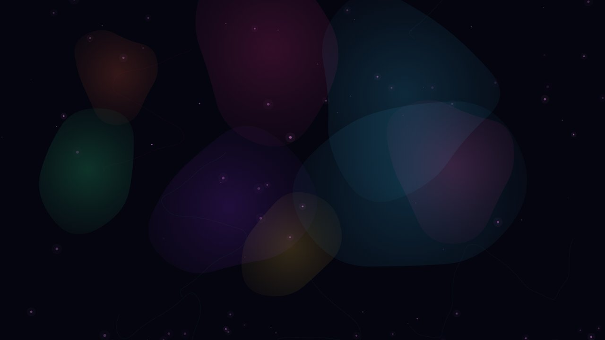
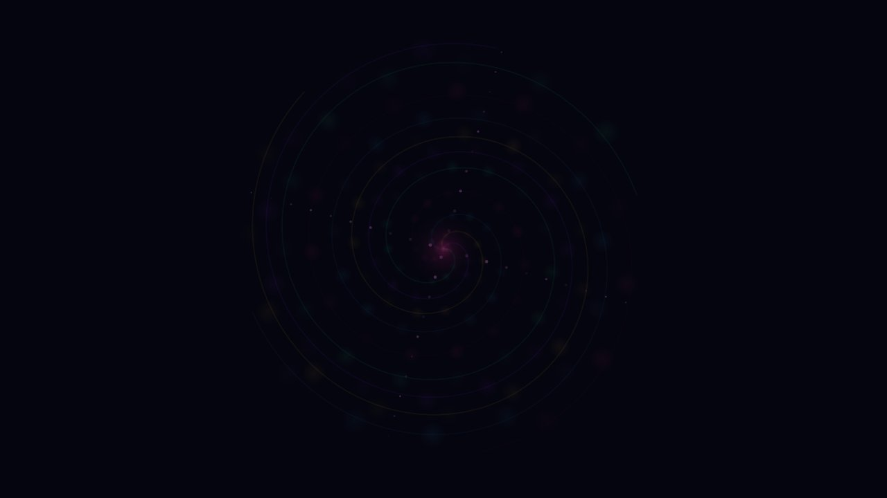
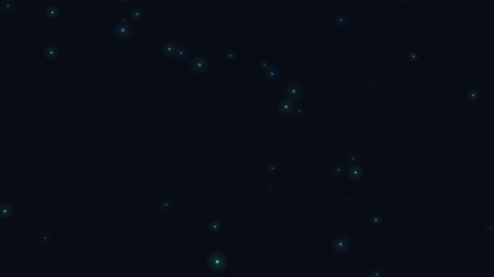

# Tripsitter

**Immersive visual experiences for your screen and TV.**

A browser-based visualizer that renders calming, psychedelic animations — perfect for meditation, relaxation, parties, or just zoning out. Cast it to your TV with Chromecast and let the visuals flow.

**[Launch Tripsitter](https://johankladder.github.io/tripsitter/)**

  
  

  
  

## Features

- **12 handcrafted scenes** — Deep ocean, cosmos, mandala, liquid, waves, kaleidoscope, fireflies, spiral, rain, plasma, mycelium, and threads. Each one is unique with organic, noise-driven animations.
- **10 color moods** — Ocean, aurora, ember, dream, forest, sunset, ice, neon, midnight, and rose. Moods transition smoothly so the vibe never breaks.
- **Auto mode** — Sit back and let scenes and moods cycle automatically.
- **Chromecast support** — Cast directly to your TV. The receiver is optimized for smooth playback on Cast hardware.
- **Fullscreen** — One click for a distraction-free experience.
- **Zero setup** — No installs, no accounts, no dependencies. Just open the link and go.

## How to use

1. Open the [live site](https://johankladder.github.io/tripsitter/)
2. Tap anywhere to begin
3. Pick a scene and mood from the bottom panel, or enable auto mode and let it surprise you
4. Go fullscreen for the best experience
5. Optional: cast to your TV using the Chromecast button

The UI auto-hides after a few seconds so nothing gets in the way.

## Tech

Pure vanilla JavaScript and Canvas 2D — no frameworks, no build step, no dependencies. The entire app is under 105 KB uncompressed.

## License

MIT
