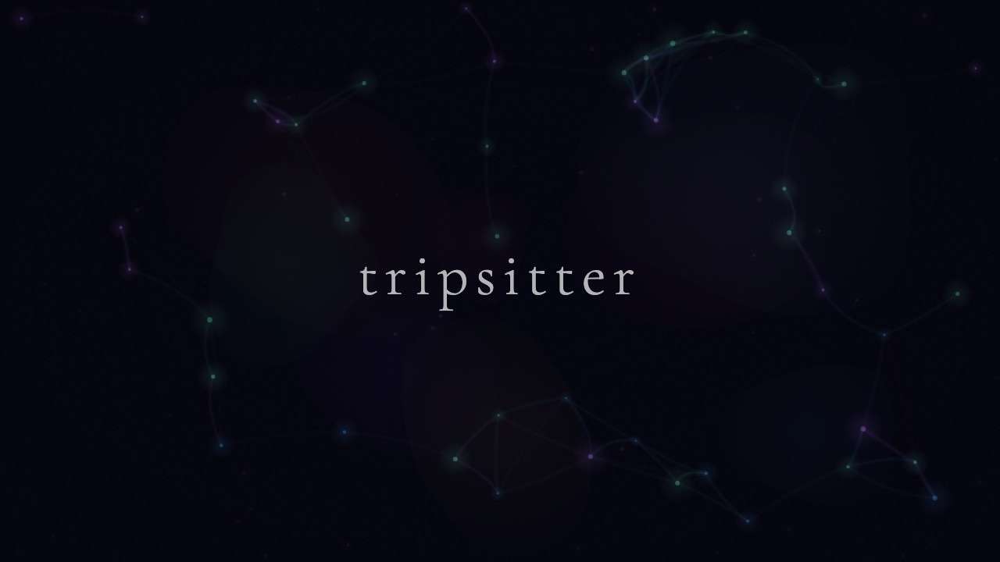

  

  <strong>Turn your screen into a living painting.</strong>
   
   
  <a href="https://johankladder.github.io/tripsitter/"><strong>Launch Tripsitter</strong></a>
  &nbsp;&middot;&nbsp;
  <a href="https://buymeacoffee.com/johankladder">Buy me a coffee</a>

 

Tripsitter is a browser-based visualizer that renders calming, psychedelic animations — perfect for meditation, relaxation, parties, or just zoning out. Cast it to your TV with Chromecast and let the visuals flow. No installs, no accounts, no dependencies — just open and go.

  

---

## Three ways to experience it

### Ambient

Lean back and watch. Pick from **12 handcrafted scenes** — deep ocean, cosmos, mandala, liquid, waves, kaleidoscope, fireflies, spiral, rain, ink, mycelium, and threads. Pair them with **10 color moods** that transition smoothly so the vibe never breaks. Or turn on **auto mode** and let it surprise you.

  
  

  
  

### Symbiosis

Two living organisms compete for energy on opposite sides of the screen. Feed them, trigger blooms, and watch their tendrils reach toward each other. Tap left or right to feed, swipe to shift colors, double-tap to bloom.

  

### Garden

Plant seeds and watch them grow into blooms — petals, spirals, stars, dandelions, and lotuses. Blooms spread tendrils to neighbors, burst into spores that seed new life, and eventually fade away. No goals, no fail state — just grow things.

---

## Cast to your TV

Tripsitter has built-in Chromecast support. Cast directly from your browser and use your phone as a remote — switch scenes, moods, and modes. Changes sync both ways, so you can control from your phone or the TV remote.

> **TV remote:** D-pad changes scenes and moods. Short-press Enter for actions. Long-press Enter to return to the mode selector.

---

## Getting started

1. Open the **[live site](https://johankladder.github.io/tripsitter/)**
2. Pick a mode — **Ambient**, **Symbiosis**, or **Garden**
3. Go fullscreen and enjoy

That's it. The UI auto-hides after a few seconds so nothing gets in the way.

---

## Tech

Pure vanilla JavaScript and Canvas 2D — no frameworks, no build step, no dependencies.

---

## Support

If you enjoy Tripsitter, consider buying me a coffee!

## License

MIT
